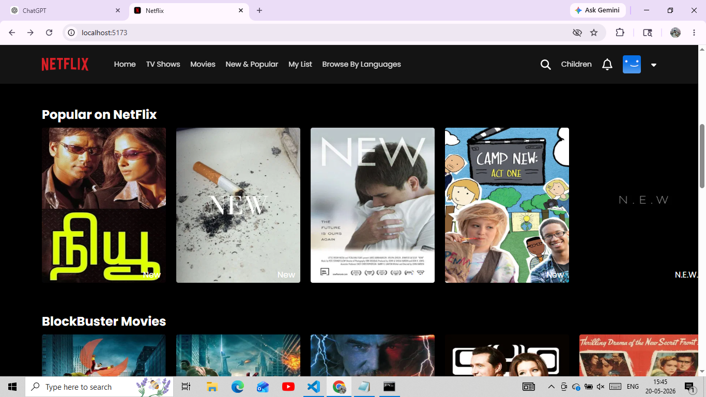
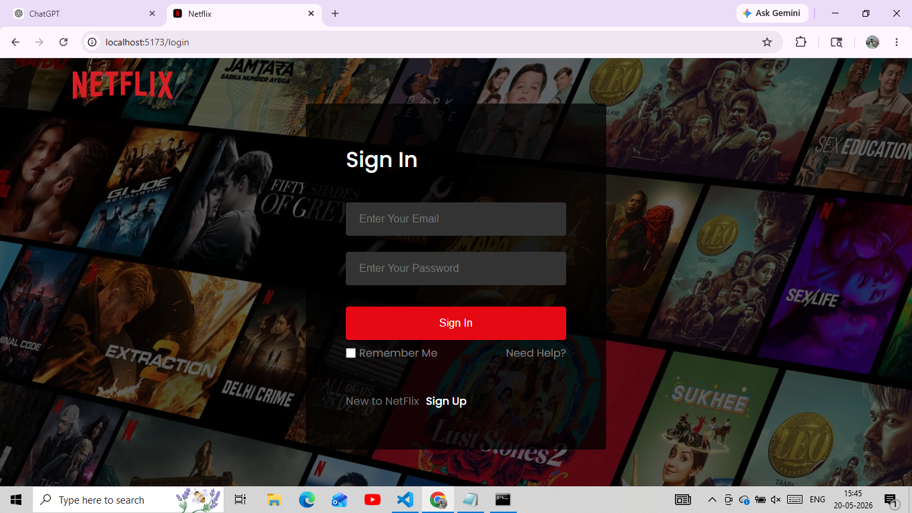

# Netflix Clone (React + Watchmode API)

A Netflix UI clone built using React and Watchmode API (now converted to static JSON for performance and no rate limits).

---

## Features

- Browse movies by categories
- Netflix-style horizontal scrolling rows
- Movie details with posters
- Fully static data (no API limits)
- Responsive UI

---

## Tech Stack

- React JS
- CSS
- React Router
- JavaScript (ES6+)

---

## Screenshots

### Home Page

---

### Movie List

---

### Footer Section

### Trailer screen

### Login screen

---